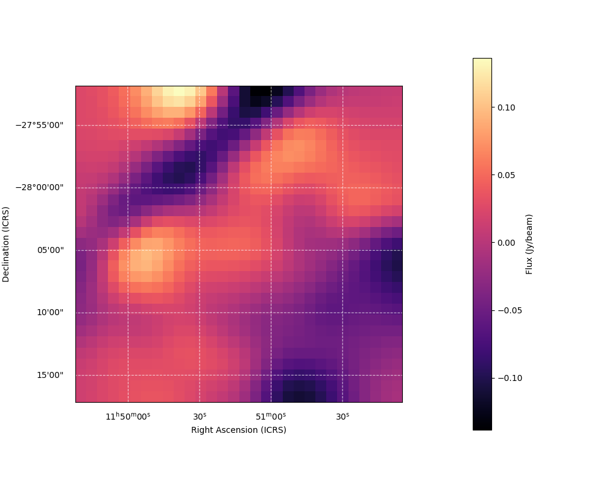

# Motivation and Goal

In this project I want to learn how to make a .yml file that sets up a conda env, how to make a config shell script that contains all the user's local info, and primarily visualize fits files.  
The main reason I hope to visualize fits files is for a poster I will be creating on my work in Professor Kallan's ISU. For this I hope to create the coadd graph and an overlay of the coadd graph with the emode map in order to easily see the mass centralized around the galaxy cluster.  

# Setup
First to clone this repo run the command  

```bash
$ git clone https://github.com/AdamField118/VisFITS.git
```

Make sure to do this inside the weak lensing directory, or whatever directory you have both superbit-lensing and SMPy in!  
I made this code capable of running with the sblens venv, but if you either don't have sblens or want to save some compute time, run the following command:  

```bash
$ conda env create -f visfits.yml
```

from inside the VisFITS directory.  
Now edit the config file, you should only have to edit two things:  

```sh
export cluster_name="PLCKG287d0p32d9"
export band_name="b"
```
and only if you want to use sblens edit: 
```sh
export CONDA_ENV="visfits"
```  
I will say that using visfits rather than sblens decreased the time it takes to produce the plots from 41 seconds to 8 seconds.  
If you are part of the ISU with Professor Berglund and Dr. Henry, you likely do not need to touch band_name either, just the cluster_name!  
# Prereqs 
This assumes that you have successfully completed the superbit-lensing processing.
## SMPy FITS output!  
The big one I would like to emphasize is that this also assumes you have run through SMPy, but gone into the config file and turned save as fits to true (should be right under the E and B mode option).
# Running
Next just run the following command (from the VisFITS directory):
```bash
$ sbatch submission.sh
```
# Results
Here is the emode plot from SMPy:

<div align="center">
  
  <p>Figure 1. SMPy output.</p>
</div>


<div align="center">
  
  <p>Figure 2. VisFITS output.</p>
</div>


<div align="center">
  
  <p>Figure 3. Coadd VisFITS output.</p>
</div>

But I would like to direct your attention to the scale and interval of both Dec and RA. This discrepancy makes it really hard to compare the coadd and emode results. This is the point of future improvement!  